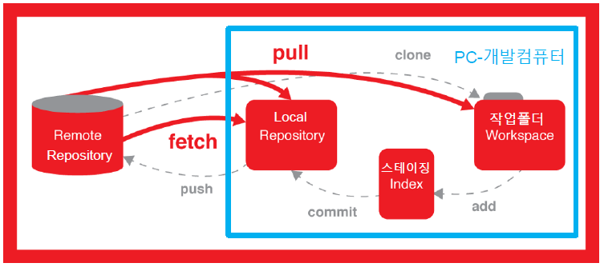

# VCS (Version Control System)

## 1. VCS란?
   - 각종 문서 및 개발 소스 버전 제어 및 변경 관리 시스템
   - 형상관리 시스템 및 개발 협업 관리 시스템
  
## 2. 사용목적
   - 개발 소스 버전 및 변경 관리
   - 개발소스 백업관리
   - 팀 단위 협업 개발
   - 개발소스 배포 자동화 관리

## 3. VCS의 종류
 
    (1) Git
    - 전세계적으로 가장 많이 사용하는 무료 오픈소스 VCS
    - 로컬 저장소(개발자 PC)와 서버 저장소를 모두 제공하는 분산 저장소 모델 제공(저장소 2개)
    - 로컬 저장소에 코드를 저장하여 작업하고 추후 내 PC에 저장된 로컬 저장소의 코드와 서버 저장소의 코드를 머지 할 수 있음(머지 하기 전에 테스트는 필수~!)
    - 소스 제어 속도가 빠르고 효율적이며 성능이 좋다.

    (2) CVS & SVN (Sub Version)
    - VS는 전통적으로 많이 사용해오던 클라이언트 서버 기반 오픈소스 무료 VCS 시스템
    - SVN은 CVS의 후속 버전으로 CVS의 개선된 버전이며 클라이언트-서버 저장소 모델 기반 VCS 시스템
    - SVN은 TortoiseSVN과 같은 우수한 GUI 클라이언트 도구를 제공 (SVN은 폐쇄망)
    - SVN은 Git 이전에 가장 보편적으로 많이 사용하던 VCS 툴

    (3) TFS (Team Foundation Server)  & VSTS(Visual Studio Team Service)
    - TFS는 마이크로소프에서 제공하던 사용 ALM Tool ( 소프트웨어 관리 툴 // 어플리케이션 라이프사이클 )
 

 
 

# Git (분산형 버전 관리 시스템)

 

* 서버기반 VCS

 

* 분산형 VCS
---

## 1. Git의 주요 개념
  
    (1) Repository(저장소)
    - 저장소(Repository) 는파일이나 폴더의 변경이력을 기록해두는 저장소
    - 로컬저장소 : 내 PC에서 작업 폴더(프로젝트)의 변경이력을 관리하는 개인별 전용 저장소
    - 원격저장소 : 원격 저장공간에서 관리되며 여러 사람의 작업 내역을 함께 공유하기 위한 저장소
    - 평상시에는 내 PC 로컬 저장소에서 작업하다가 작업한 내용을 공개/공유하고 싶을 때 (협업)에 원격 저장소에 업로드 한다.
    - 원격 저장소를 통해 다른 사람이 공유한 작업파일을 로컬 저장소로 가져올 수 있다.

    (2) Work Tree (작업트리 = 작업공간 = 플젝트 폴더) & Index 가상공간
    - Git에서 작업 폴더 공간을 Work Tree 또는 Workspace 라고 한다.
    - 커밋을 실행하기 전의 로컬 저장소와 작업 공간 사이에 존재하는 공간을 인덱스(가상공간) 이라고 한다.
    - 작업 폴더내 추가/삭제/변경된 파일,폴더에 대한 상태를 인덱스란 가상 공간에 먼저 등록하고 인덱스에 등록된 변경사항들이 최종 로컬 저장소에 반영(커밋)된다.
 

- 작업폴더(Workspace) : 내 pc 개발폴더
- 작업폴더에서 소스를 추가/변경/삭제 후 Index(가상공간)에 **git add .** 명령어를 사용하여 추가한다.
- Index에 저장된 내역(소스코드 등)은 **git commit -m "feat:변경메시지"** 로 Local Repository에 반영한다.
 

## 2. Git Command with Console

    (1) git init
    - 프로젝트 폴더를 git 관리대상 폴더로 지정
    - 물리적으로 해당 프로젝트 폴더 아래에 .git 로컬 저장소 (숨김) 폴더 생성

    (2) .gitignore
    - 소스제어 버전관리 (제어 안한다는 뜻)

    (3) git add .
    - 현재 명령어 실행 위치내 모든 (신규추가/변경/삭제) 리소스 작업내역을 index 가상 공간에 기록 (스테이징)하는 명령어
    - 프로젝트 내 파일이나 폴더 추가/변경/삭제 한 후에는 반드시 git add . 을 통해 파일변경상태를 추가(스테이징)한 후 커밋 작업을 진행

    (4) git config
    - 누가 작업했는지.. Git 사용자 계정 정보 설정하기
    git config --global user.name "boram"
    git config --global user.email "boram910530@gamil.com"
    
    (5) git commit - m “수정내역”
    - 작업 수정 메시지

    ** 파일이나 폴더 추가/삭제/변경 하면 무조건 git add . 후 git commit - m 으로 작업 수정 메시지 남기기
---
컴퓨터에게 일을 시키는 방법
  - GUI - Graphic User Interface (버튼으로 동작)
  - CLI - Command Line (터미널에 직접 입력)
---