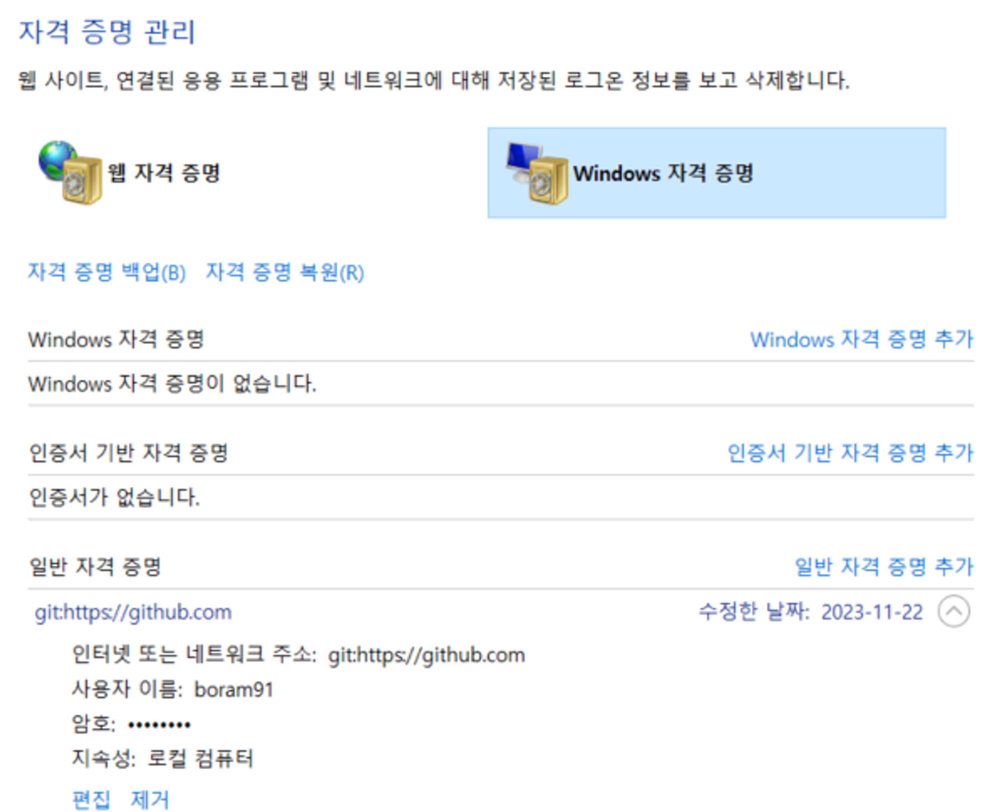
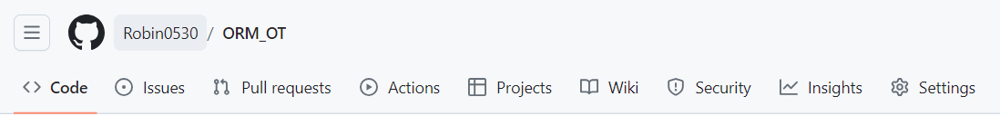

# GitHub 원격저장소 서비스

## 1. GitHub란?
- 오픈소스 및 비지니스용 Git 원격 서버 저장소 (분산 무료 원격 저장소)
- 공개 저장소(퍼블릭)와 프라이빗 저장소로 나뉘며 프라이빗 저장소는 허락된 사용자들에게만 소스가 공유됨
- 유사 원격 Git 원격 저장소 서비스로는 GitLab 또는 BitBucket이 존재

## 2. 원격 저장소 추가 및 소스 반영
    1. Git에 GitHub 원격 저장소 주소 정보 추가하기
    - git remote add [연결주소 닉네임][주소]
        => git remote add origin https://github.com/iami5246/nodesample1.git
    - 원격 저장소 정보 삭제하고 재설정하기
    - git remote [연결주소 닉네임] 제거 후 상기 재 추가

    2. git branch -M main : 로컬 저장소 (개발자 pc)에서 깃으로 만든 로컬 저장소의 기본 브랜치인 마스터 브랜치 -master branch 이름을 main branch로 이름을 바꿔준다.
        => 왜?? 깃허브 원격저장소의 기본 브랜치 이름이 main branch 이니까 로컬 저장소의 기본브랜치명과 원격브랜치명을 동일하게 해줘야 에러가 안난다.

    3. GitHub 원격 저장소에 소스 반영하기
    - git push [연결주소 닉네임][main 브랜치명]
        => git push origin main

---
### Tip!!
TIP : 깃허브 계정 여러개일때 vscode에서 저장소 여러개 관리하는 방법 (토큰 날리기)

내 pc → 자격증명 관리자 (내 깃허브 토큰 정보 확인가능)

---

## 3. 원격 저장소 소스 내려 받기
GitHub 원격 저장소에서 소스 내려받기
- git clone [원격저장소 URL]
 => git clone https://github.com/iami5246/nodesample1.git

## 4. 원격 저장소 협업 관리
저장소 > Settings> Collaborators> 협업 사용자 초대

## 5. 원격 저장소 삭제
저장소 > General > 맨 하단 Danger Zone

  

** 일반적으로 main branch는 안건듬 (원본) 

무조건 branch 복사해서 수정한다.

  

## * Git 로컬 저장소 관리하기

    1. Git 로컬 저장소 관리 
        (1) 개발소스 만들기
        (2) 로컬 git 저장소 만들기
       - git init

    2. Git 소스 추가 및 스테이징 관리
       - git add .

    3. Git 커밋 관리하기
        (1) 로컬 저장소 반영사항 저장
       - git commint -m “feat 최초커밋”
        (2) 커밋 메시지 포맷
       - type(): [#issueNumber]제목 : 필수
       - Body:옵션> 커밋내용
       - footer

        (3) 커밋 메시지 형식 해설
        ▼ type (feat,fix,docs,style,reactor,test,chore,release ): [#issueNumber]제목 : 필수
        -feat : 새로운 기능을 추가하거나 기존의 기능을 요구 사항 변경으로 변경한 경우
        기능 추가와 수정을 나누어서 쓰고 싶은 경우 아래 처럼 22개로 나누어서 타입을 지정할 수 있다
        -new : 새로운 기능을 추가 한 경우
        -improve : 기존 기능을 수정 한 경우, 요구 사항이 변경되어 수정된 경우에도 improve 타입으로 한다
        -fix : 기능상 버그 픽스를 했을 경우
        -docs : 문서 주석 의 추가 수정의 경우, 직접적인 코드의 변화 없이 순수하게 문서 주석 만 추가 수정했을 경우
        -style : UI를 추가 변경 하거나 스타일 관련 작업을 했을 경우
        refactor : 기능의 변화가 아닌 코드를 리팩토링했을 경우, 코드 리뷰 등으로 로직 기능 의 변화 없이 단순 함수 내부에서만 사용하는 이름을 변경하였거나, 코드 pretty 등을 적용했을 경우
        -test : 테스트 코드를 별도로 추가하거나, 변경했을 경우, 만약 기능을 추가하면서 테스트 코드를 동시에 작성했으면 feat 타입으로 사용
        -chore : 기능 테스트 코드, 문서, 스타일, 리팩토링을 제외한, 배포, 빌드 등과 같이 프로젝트의 기타 작업들에 대해 추가 수정했을 경우, lint 등의 적용으로 코드 스타일을 수정 했을 때도 chore 사용
        -release: 릴리스를 하기 위해 패키지 버전을 올리거나, 릴리스 버전 커밋을 찍기 위한 경우
        ▼ Body : 옵션> 무엇을 왜 형식으로 작성
        - 추가/수정한 내용1
        - 추가/수정한 내용2
        ▼ Footer
        - Resolves : 문의나, 요청에 의한 이슈에 해당하는 경우 이슈 번호
        - Closes : 일반적인 개발과 관련된 이슈에 해당하는 경우 이슈 번호
        - Fixes : 버그 픽스, 핫 픽스 관련 이슈에 해당하는 경우 이슈 번호
        - See also : 커밋의 이슈와 연관되어 있는 이슈들이 존재 하는 경우, 또는 관련된 이슈들이 있는 경우 이슈 번호

        (4) 커밋 메시지 예시
        - feat : 회원가입 UI 페이지 추가
        - 회원가입 뷰 페이지 추가
        - feat : 회원정보 난독화 코드 적용
        - *회원 전화번호 난독화 적용 저장
        - *회원 집주소를 난독화 적용 저장
        - fix : [#1001]회원 탈퇴 프로세스 버그 수정

        - * 회원 탈퇴 처리시 회원정보 삭제하지 않고 비활성화 처리 적용
        - Resolves: #1001
        - See also: #1000, #1002

  

# GitHub 원격 저장소 생성 및 관리

## 1. GitHub 원격 저장소 생성하기
(1) GithubGithub원격 저장소 생성 및 주소 복사
  - github사이트에서 신규 원격저장소 생성하기
  - 원격저장소 링크 복사

## 2. 원격 저장소 주소 등록
(1) 원격 저장소 주소 등록
  * git remote add origin [깃허브 원격저장소 주소]
   =>git remote add origin https://github.com/eddykang1074/sample4.git

## 3. Git 로컬 저장소 소스 원격 저장소 반영
* git push origin main

  

# Git 로컬/원격 브랜치 관리하기
## 1. Git 브랜치 목록 관리
(1) 브랜치 목록 확인
* git branch

## 2. 로컬 브랜치 생성 및 원격 브랜치 반영
(1) 신규 브랜치 생성
* git branch [신규 브랜치명]
 => git branch robin-branch
* git checkout [생성한 브랜치명] : 생성한 브랜치로 이동
 => git checkout robin-branch

(2) 로컬 브랜치 기반 원격 브랜치 생성하고 소스 반영
* git push [원격저장소 닉네임] [브랜치명]
 => git push origin robin-branch

## 3. 로컬 브랜치 병합 및 원격 저장소 반영
(1) 로컬 브랜치에서 수정작업하고 원격 브랜치에 작업내용 반영
* git checkout [브랜치명]
 => git checkout robin-branch
* git add .
* git commit -m "robin-branch 수정"
* git push origin [브랜치명]
 => git push origin robin-branch

(2) 로컬 브랜치 병합 및 원격 저장소 반영
* git checkout main : 메인 브랜치로 이동하기 현재 브랜치의 모든 내용을 커밋한다
  - 메인 브랜치로 이동
* git pull origin main : origin 원격저장소 안에 main branch에서 가져와 (서버 branch에 있는 main 소스코드를 내 local main branch에 가져오기) 최신버전!!! 필수!
  - 원격 저장소 최신버전 가져오기
* git merge [브랜치명] : main 브랜치에 대상 브랜치 내용 병합하기
  - git merge robin-branch
* git push origin main
  - 로컬 메인 원격저장소 메인에 반영하기

### 브랜치 예시
|Local Storage (개발자 pc : Local PC )|Remote Stroage (인터넷 서버 저장소 : Github)|
|------------------------------------|-------------------------------------------|
|⨽Default Branch : master⇒main|⨽Default Branch : main||
|⨽ CASE1) Default Branch 삼성전자 브랜치 (신규기능추가/기존기능제거/기존기능변경)||
|⨽ CASE2) 현대자동차 브랜치||
|⨽ CASE3) 신규기능 구현 - 우성우-wswbranch-담당 기능 구현||
|⨽ CASE4) 신규기능2 구현 - 강창훈-eddbranch-담당 기능 구현||
|⨽ DEV BRANCH||
|  ⨽ TEST BRANCH (Dev Branch 복사해서 test)||
---
 

---
**GitHub Menu**

- Code : 코드
- lssues : 이슈
- Pull requets : 내 branch에서 작업 후 메인 branch에 머지하기 전에 결정권자에게 결정받는 곳 (요청)
- Actions :  배포자동화 기능
    - CI : 소스의 지속적인 통합
    - CD : 통합되어 반영된 소스를 지속적으로 소스 배포(운영)
- Settings : 협업 유저 추가 등 중요 설정
---
